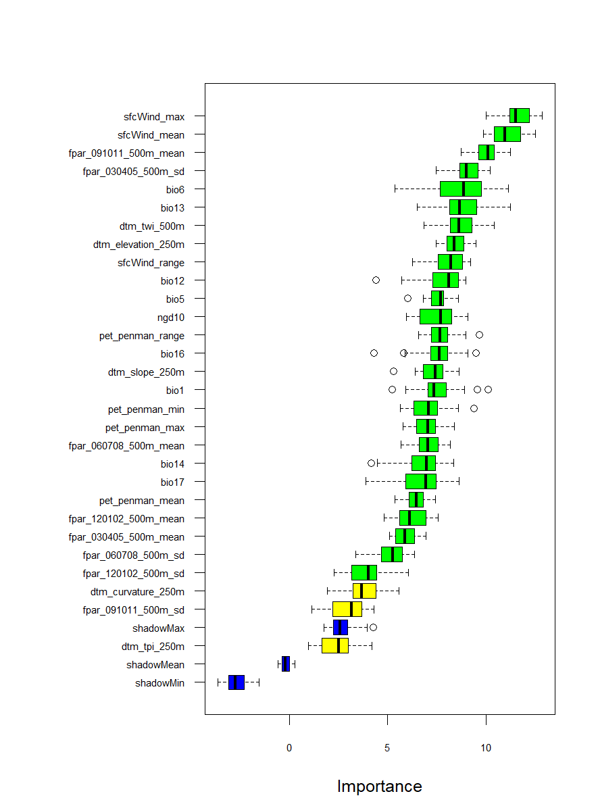
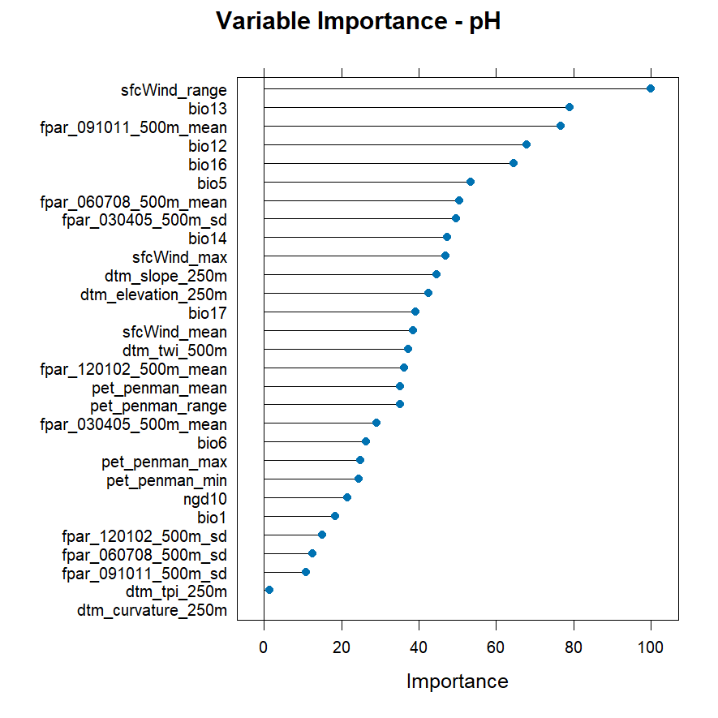
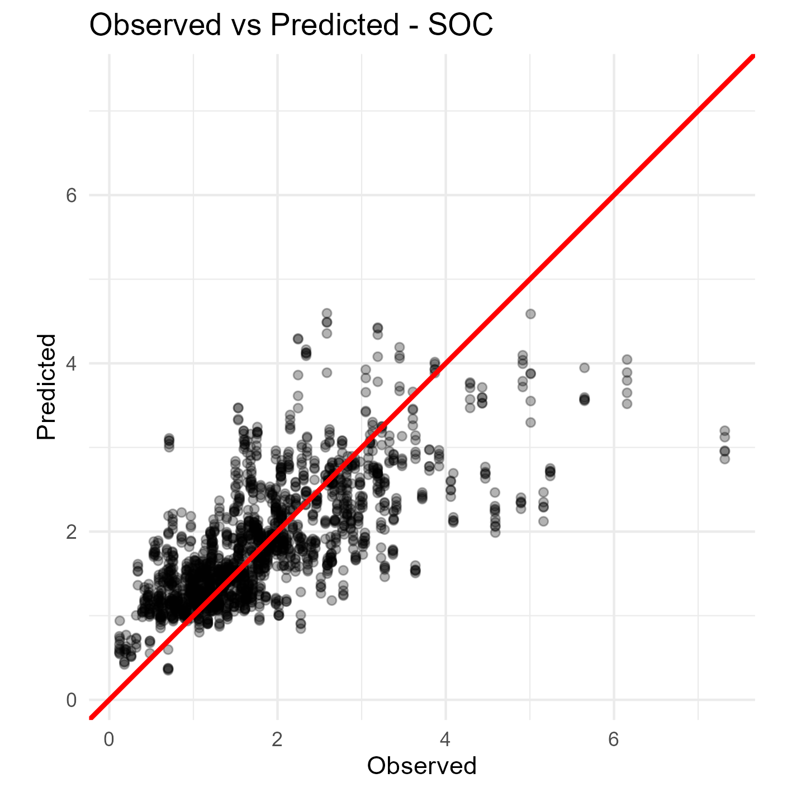

# Digital Soil Mapping

```{r setup-ch3, include=FALSE}
knitr::opts_chunk$set(echo = TRUE, message = FALSE, warning = FALSE,
                      fig.width = 10, fig.height = 7)

RESOURCES_ROOT <- normalizePath(file.path(here::here(), "../SoilFER-Training-Resources"))
OUTPUTS_DIR    <- file.path(RESOURCES_ROOT, "03_outputs", "module3")
FIGURES_DIR    <- "images/module3"

TERRA_TMPDIR <- file.path(tempdir(), "terra_module3")
dir.create(TERRA_TMPDIR, showWarnings = FALSE, recursive = TRUE)
if (requireNamespace("terra", quietly = TRUE))
  terra::terraOptions(tempdir = TERRA_TMPDIR)

set.seed(2024)
```


## Fundamentals of Digital Soil Mapping

### Introduction to Digital Soil Mapping

Digital soil mapping (DSM) is a modern approach that uses quantitative methods to create soil maps. It combines field observations, laboratory data, and environmental information within a spatial framework [@Lagacherie2008]. DSM represents a significant change from traditional soil survey, where maps were created based mainly on expert knowledge and manual interpretation of landscapes.

Traditional soil survey relied on a soil surveyor's conceptual model of the landscape. Surveyors used aerial photographs, satellite images, and field observations to identify soil patterns. However, this approach had important limitations: maps were subjective, difficult to update, and lacked quantitative measures of uncertainty [@Minasny2016].

The evolution towards digital methods began in the 1970s when researchers started using computers to store and analyse soil data. @Webster1979 demonstrated early digital soil cartography in England, while soil information systems were developed to manage soil databases. During the 1980s, the development of geographic information systems (GIS) and geostatistics provided new tools for spatial analysis. The 1990s brought advances in digital terrain modelling, data mining, and machine learning methods such as classification trees and neural networks.

The success of DSM in the early 2000s resulted from several factors: increased availability of digital elevation models and satellite imagery, greater computing power, development of data mining tools, and a growing global demand for soil information with uncertainty estimates [@Minasny2016]. Universities and research centres began producing soil maps that were previously only made by national survey agencies.

Today, DSM is defined as the creation of spatial soil information systems using field and laboratory observations combined with spatial inference methods [@Lagacherie2006]. The theoretical framework for DSM was formalised in 2003, establishing the conceptual basis that guides current practice.

### The SCORPAN Framework

The conceptual and methodological foundations of DSM were formalised by the *scorpan* framework [@McBratney2003]. This model represents a quantitative expansion of the classical factors of soil formation originally proposed by Dokuchaev in 1883 and later refined by @Jenny1941. While Jenny's *clorpt* model (climate, organisms, relief, parent material, time) was developed to explain soil genesis, the *scorpan* framework transforms this explanatory approach into an empirical predictive tool for spatial mapping.

The fundamental distinction between the two frameworks lies in their purpose. Jenny's model describes how soils form through the interaction of environmental factors over time—it is a qualitative, theoretical framework. The *scorpan* approach, in contrast, does not attempt to explain soil formation mechanistically but rather exploits empirical relationships between soil and environmental variables for prediction [@McBratney2003]. As noted by the authors, the direction of causality is not considered: where evidence of a relationship exists, it can be used for prediction regardless of whether the factor causes or is caused by soil properties.

The *scorpan* acronym identifies seven environmental factors that influence soil distribution:

-   **s**: soil—other properties of the soil at a point, including information from prior maps, proximal or remote sensing, or expert knowledge
-   **c**: climate—properties of the environment such as precipitation, temperature, and evapotranspiration
-   **o**: organisms—vegetation, fauna, or human activity, often represented by land cover or spectral indices
-   **r**: relief—topographic attributes derived from digital elevation models
-   **p**: parent material—lithology and geological substrate
-   **a**: age—the time factor representing soil development duration or geomorphic surface age
-   **n**: space—spatial position expressed as geographic coordinates

Two additional factors distinguish *scorpan* from Jenny's original formulation. First, soil itself (s) is included as a predictor because soil properties can be predicted from other soil attributes measured at the same location or from existing soil maps. Second, the spatial factor (n) explicitly incorporates geographic position, which captures spatial trends and autocorrelation not explained by the other environmental factors [@McBratney2003]. The spatial coordinates can be used directly or transformed into derived variables such as distance to coast or distance from discharge areas.

The general pedometric model is formulated as:

$$S_c = f(s, c, o, r, p, a, n) + \varepsilon$$

or for soil attributes:

$$S_a = f(s, c, o, r, p, a, n) + \varepsilon$$

This can be expressed more compactly as:

$$S = f(Q) + \varepsilon$$

where $S$ denotes a soil class ($S_c$) or attribute ($S_a$) at a specific location, $f(Q)$ represents a deterministic function of the *scorpan* covariates, and $\varepsilon$ represents the spatially autocorrelated residual. The complete methodological approach is termed *scorpan-SSPFe* (Soil Spatial Prediction Function with spatially autocorrelated errors), where deterministic predictions from $f(Q)$ are complemented by geostatistical modelling of residuals to account for spatial structure not captured by the covariates [@McBratney2003].

Each *scorpan* factor is represented by one or more environmental covariates. For example, climate (c) may be represented by mean annual precipitation and temperature; relief (r) by slope, aspect, curvature, and terrain wetness index; and organisms (o) by satellite-derived vegetation indices such as NDVI. The selection of covariates depends on data availability, mapping scale, and the soil property being predicted.

The *scorpan-SSPFe* approach represents a paradigm shift in soil mapping [@McBratney2003]. While the conventional Jenny model follows a deductive-nomological framework, the *scorpan* approach follows an inductive-statistical model of explanation. Both frameworks share the same ontological basis—soil as a function of environment—but differ fundamentally in methodology and apparatus. The *scorpan* approach requires digital data, computing resources, and statistical methods for fitting $f()$, whereas traditional mapping relies primarily on expert mental models and field interpretation.

### Statistical Theory for Predictive Soil Mapping

The spatial heterogeneity of soil properties results from complex interactions among soil-forming factors that are often only partially characterised. While the deterministic influences of climate, organisms, relief, parent material, and time are well-recognised, their synergistic interaction over pedogenic timescales presents significant challenges for mechanistic modelling [@HeuvelinkWebster2001]. Soil varies continuously in space and time, and any description of this variation is inevitably incomplete. Soil scientists must therefore represent this variation using models that combine deterministic and stochastic components [@HeuvelinkWebster2001].

#### Mechanistic versus Empirical Approaches

Mechanistic modelling (also referred to as process-based or white-box modelling) involves the mathematical representation of soil systems based on known physical, chemical, and biological processes. Unlike empirical models that rely on statistical correlations, mechanistic models attempt to simulate the actual mechanisms of soil formation and function—such as water movement, solute transport, organic matter decomposition, and soil erosion—over time and space [@Wadoux2021]. These models typically use systems of differential equations to describe the state of the soil system and its evolution.

@Wadoux2021 distinguish between mechanistic and functional (empirical) models for soil mapping. Mechanistic models have structures based on mechanisms derived from knowledge of physical processes and soil chemical and biological reactions. Examples include soil erosion and deposition models, soil-landscape evolution models, and soil carbon dynamics models. However, the main problems with mechanistic approaches are that they require adequate mechanistic understanding of major soil processes, need extensive input data that are often unavailable, have many parameters that are difficult to infer, are computationally challenging, and typically do not quantify prediction uncertainty.

Although advancements have been made in modelling vertical soil variation through process-based approaches, these methods remain primarily experimental and are not yet suitable for large-scale operational soil mapping [@Zhang2024]. Consequently, most operational DSM follows an **empirical approach**. Instead of simulating every physical process, empirical models use statistical relationships between soil properties and environmental covariates to make predictions [@McBratney2003].

Recent research has explored hybrid approaches that integrate process-oriented (PO) and machine learning (ML) models. @Zhang2024 proposed a framework where PO model outputs serve as additional covariates for ML models, combining the ability of PO models to capture temporal dynamics with the spatial prediction accuracy of ML models. This integration represents a promising avenue for dynamic soil mapping that addresses one of the ten challenges for the future of pedometrics [@Wadoux2021].

#### Sources of Residual Variance

Regression models frequently account for only a portion of the total soil variance. This limitation arises from several factors [@Hengl2007; @Wadoux2021]:

1. **Model structure limitations**: The deterministic model structure may fail to represent actual mechanistic pedogenic processes adequately.
2. **Missing causal factors**: Models often exclude significant causal factors that influence soil variation.
3. **Covariate limitations**: Environmental covariates serve as incomplete proxies for true soil-forming factors (see section below).
4. **Measurement errors**: Covariates contain inherent measurement errors or suffer from scale (support) mismatches relative to soil observations.
5. **Spatial scale effects**: Soil properties vary at spatial scales from the atomic to the global, and the factors causing variation at one scale may differ from those at other scales [@Wadoux2021].

Given these constraints, soil spatial models often exhibit substantial residual variance. When these residuals demonstrate spatial autocorrelation—quantifiable through variogram analysis—the application of kriging techniques to the residuals can significantly improve prediction accuracy [@McBratney2003; @Hengl2007].

#### Covariates as Proxies of Soil-Forming Factors

In DSM, we use the terms **proxy** and **covariate** when referring to environmental data layers used to predict soil properties. A proxy is an indirect measurement of a variable that is difficult to measure directly. Since we cannot measure the exact historical climate or the precise biological activity that has occurred at every location over millennia, we use available data that correlates with these processes [@McBratney2003].

For example, a **Normalized Difference Vegetation Index (NDVI)** map derived from satellite imagery is not the "organisms" factor itself but serves as a proxy for vegetation biomass and productivity, which influences organic matter inputs to the soil.

While the *scorpan* framework is based on soil-forming factors, the digital layers we input into models are mathematical representations rather than the physical factors themselves. There are four primary reasons for this distinction [@Lagacherie2008; @Kempen2009]:

1. **Temporal mismatch**: Soil formation occurs over centuries or millennia, but most climate covariates are based on the last 30 to 50 years of data. These represent proxies for the long-term climate that actually formed the soil.
2. **Information loss and simplification**: A Digital Elevation Model represents relief, but it is a grid of numbers representing average heights within pixels. It misses fine-scale terrain nuances that influence water flow and erosion.
3. **Measurement error**: Every digital layer contains inherent errors. Satellite sensors have noise, and climate station data are interpolated across spatial gaps.
4. **Indirect correlation**: Often, a covariate represents multiple factors simultaneously. Elevation (relief) correlates strongly with temperature (climate), making it a statistical surrogate rather than a pure physical factor.

#### The Universal Model of Soil Variation

In DSM, we mathematically decompose soil variation into distinct components to better understand and predict soil patterns. This decomposition follows the **Universal Model of Soil Variation** [@Webster2007; @HeuvelinkWebster2001]:

$$Z(s) = m(s) + \varepsilon'(s) + \varepsilon''(s)$$

Where:

- $Z(s)$: The value of a soil property at a specific location ($s$)
- $m(s)$: The **deterministic component** (trend)—the part of soil variation explained using environmental covariates
- $\varepsilon'(s)$: The **spatially correlated stochastic component**—variation that follows a spatial pattern but is not captured by covariates
- $\varepsilon''(s)$: The **pure noise**—measurement errors and fine-scale variation

This decomposition provides the theoretical foundation for hybrid interpolation methods such as regression-kriging, where the trend $m(s)$ is modelled as a function of environmental covariates and the spatially correlated residual $\varepsilon'(s)$ is interpolated using kriging [@Hengl2007; @Odeh1995].

@Hengl2007 demonstrated that regression-kriging explicitly separates trend estimation from residual interpolation, allowing the use of arbitrarily complex regression forms. The method can be expressed as:

$$\hat{Z}(s_0) = \hat{m}(s_0) + \hat{\varepsilon}'(s_0)$$

where $\hat{m}(s_0)$ is predicted from the regression model and $\hat{\varepsilon}'(s_0)$ is obtained by kriging the regression residuals.

#### Extending the Model: Space, Depth, and Time (3D+T)

While a 2D map describes soil variation at a single depth layer, soils are three-dimensional bodies that change over time. The Universal Model can be generalised to include depth ($d$) and time ($t$) [@HeuvelinkWebster2001]:

$$Z(s, d, t) = m(s, d, t) + \varepsilon'(s, d, t) + \varepsilon''(s, d, t)$$

This **3D+T (spatio-temporal)** model allows tracking how soil properties change with depth and evolve over time. @Heuvelink2016 noted that 3D kriging, where depth is treated as a third dimension, has important advantages because predictions at any depth interval can be made. However, modelling vertical variation realistically is challenging due to zonal and geometric anisotropies and discontinuities at horizon boundaries. Soil observations are typically averages over depth intervals and cannot be treated as vertical points. Mass-preserving splines have been developed to address this issue [@Bishop1999; @Orton2014], though they introduce additional uncertainties.

::: Highlights
**Example: Weekly Soil Moisture Mapping**
A classic example of the need for spatio-temporal modelling is **soil moisture**. Unlike soil texture (which changes very slowly over decades), soil moisture fluctuates daily or weekly based on rainfall and evaporation. Creating weekly maps of soil moisture requires a space-time framework considering location ($s$), time ($t$), and depth ($d$) simultaneously.
:::

However, moving from 2D to 3D+T significantly increases analytical complexity. Each additional dimension requires more model parameters to be estimated, and the data requirements increase substantially.

> **2D+T and 3D+T models**: Because data requirements for 2D+T and 3D+T models are high, they remain experimental in many regions. For most projects, focusing on high-quality 2D or 3D (depth-only) mapping is the standard starting point. Recent developments in integrating process-oriented models with machine learning offer promising approaches for capturing temporal dynamics while maintaining spatial prediction accuracy [@Zhang2024].

### Types of Soil Variables

Soil variables are classified into two fundamental categories based on their mathematical nature, and this distinction has important implications for the choice of prediction methods [@McBratney2003]:

**Continuous Variables (Soil Properties):** These are attributes measured on a numerical scale that can take any value within a range. Common examples include clay content (%), soil organic carbon concentration (g kg⁻¹), pH, bulk density (g cm⁻³), and cation exchange capacity (cmol kg⁻¹). From a pedological perspective, these properties typically change gradually across space, reflecting the continuous nature of soil variation [@HeuvelinkWebster2001]. However, some properties may exhibit abrupt changes at lithological boundaries or landscape discontinuities.

**Categorical Variables (Soil Classes):** These represent qualitative groups or discrete soil attributes. Examples include soil taxonomic units (e.g., Mollisol, Alfisol), drainage classes, or horizon designations. Traditional soil classification follows a "top-down" model where soils are divided into mutually exclusive classes with sharp conceptual boundaries [@Odgers2011]. However, the intrinsic variability of soil means that soil usually does not exist as discrete bodies with sharp boundaries between them—either physical boundaries in the natural landscape or conceptual boundaries in the feature space [@HeuvelinkWebster2001; @Odgers2011].

**The Soil Continuum Problem:** In reality, soil grades more or less gradually from one class to another, both in the landscape and in feature space [@Odgers2011]. This has led to the development of continuous classification approaches using fuzzy set theory, where objects can belong to multiple classes with membership values that sum to one [@HeuvelinkWebster2001]. Fuzzy classification provides a more realistic representation of soil variation by quantifying the degree of similarity between soil profiles and class centroids.

### Prediction Methods

The mathematical nature of soil variables determines the type of statistical method used to create predictive maps [@McBratney2003]:

**Regression for Continuous Properties:** For continuous variables, regression algorithms establish numerical relationships between soil properties and environmental covariates. Methods range from linear approaches (ordinary least squares, generalised linear models) to non-linear techniques (generalised additive models, regression trees, neural networks, and ensemble methods such as Random Forest). The advantage of tree-based methods over linear models is their ability to handle nonlinearity and non-additive behaviour without requiring interactions to be pre-specified [@Breiman1984; @McBratney2003].

**Classification for Soil Classes:** For categorical variables, classification algorithms calculate the probability of a location belonging to specific soil classes. Methods include discriminant analysis, logistic regression, classification trees, and machine learning classifiers. Rather than producing a single "hard" classification, modern approaches often output class membership probabilities for each location, providing a richer representation of prediction uncertainty [@McBratney2003; @Kempen2009].

**Hybrid Approaches:** Some methods can handle both continuous and categorical data simultaneously. Classification and regression trees (CART) exemplify this flexibility, automatically determining splitting variables and points based on the data structure [@Breiman1984]. Tree-based models are particularly valued for their interpretability compared to methods like neural networks or generalised additive models [@McBratney2003].

### Nonlinearity and Uncertainty

A fundamental characteristic of soil-environment relationships is that they are often **non-linear and complex** [@Minasny2016]. Environmental factors do not always influence soil properties in simple, linear ways. Terrain attributes may have threshold effects, climate interactions may be multiplicative, and biological processes introduce additional complexity. Because predictive models are simplified representations of natural processes, they are never fully accurate.

Unlike traditional soil maps that provide a single deterministic view, digital soil mapping enables the quantification of **prediction uncertainty**. This means that for every prediction, we can provide measures of confidence indicating where the model is reliable and where additional data might be needed [@Padarian2023; @Styc2021]. Uncertainty can be expressed through:

- **Prediction intervals**: Upper and lower bounds within which the true value is expected to fall with a specified probability (e.g., 90% confidence interval)
- **Standard deviation or variance**: Measures of prediction spread around the mean estimate
- **Prediction interval coverage probability (PICP)**: Assessment of whether stated confidence intervals actually contain the expected proportion of true values [@Styc2021]

However, @Padarian2023 noted that uncertainty estimates remain underutilised in practice. Around 50% of DSM studies still do not report uncertainty assessments, and end users often find uncertainty maps difficult to interpret alongside target variable maps. This challenge has motivated new approaches for communicating uncertainty, including variable-resolution maps where pixel size encodes prediction confidence.

------------------------------------------------------------------------

## Practical Implementation Example

------------------------------------------------------------------------

### Overview

This section is a step-by-step companion to the script
`modelling_&_mapping_v2.R`. Its goal is to bridge the transition from
the soil data and environmental covariates explored in the preceding
chapters to the full prediction workflow: a map of the target soil
property and a map of its associated uncertainty.

The script focuses on **continuous soil variables** — the most common
case in DSM, covering properties such as soil organic carbon (SOC), clay
content, and bulk density. The workflow is divided into two
sessions:

- **Session 1**: data preparation, covariate selection, model training,
  and cross-validation accuracy assessment.
- **Session 2**: spatial prediction across the study area and generation
  of the final maps.

> **How to use this guide.** Open the R script alongside this chapter.
> Read each section here *before* running the corresponding block in the
> script. Section numbers match the numbered comments in the script.
> Code blocks are shown for reference — run them from the script in
> RStudio, not from this document.


### Setup and Packages

```{r s1-setup, eval=FALSE}
rm(list = ls())
gc()

library(tidyverse)
library(caret)
library(terra)
library(Boruta)
library(ranger)
library(mapview)

Sys.setenv(PROJ_LIB = "")  
Sys.setenv(PROJ_DATA = system.file("proj", package = "terra"))
```

`rm(list = ls())` removes every object from memory; `gc()` releases unused RAM. Starting clean prevents objects from a previous session from silently affecting results.

Each package has a specific role:

| Package | Role |
|---------|------|
| **tidyverse** | Reading CSV files, manipulating tables, plotting |
| **terra** | Reading and writing raster and vector spatial data |
| **caret** | Model training, cross-validation, hyperparameter tuning |
| **ranger** | Fast Random Forest implementation used by caret internally |
| **Boruta** | Feature selection: identifies which covariates genuinely help |
| **mapview** | Quick interactive maps for visual quality checks in RStudio |

The two `Sys.setenv()` lines reset the PROJ database path to terra's bundled copy. PROJ defines coordinate reference systems; conflicting paths left by other packages cause cryptic reprojection errors.

```{r s1-dirs, eval=FALSE}
setwd(dirname(rstudioapi::getActiveDocumentContext()$path))
setwd("../../")

for (d in c("03_outputs/module3/models/", 
            "03_outputs/module3/validation/", 
            "03_outputs/module3/tiles/",
            "03_outputs/module3/maps/",
            "03_outputs/module3/maps/aoa/",
            "terra_tmp")) {
  if (!dir.exists(d)) dir.create(d, recursive = TRUE)
}

terraOptions(progress = 1, memfrac = 0.6, tempdir = file.path(getwd(), "terra_tmp"))
```

`setwd()` navigates from the script folder up two levels to the project root, making all subsequent file paths relative and portable. The `for` loop pre-creates every output folder needed by the workflow. `terraOptions()` enables a progress bar, allows terra to use 60% of available RAM before spilling to disk, and redirects large temporary raster files to a known folder inside the project.


Let me check the Excel file for the official descriptions:

Here is the complete Section 2 ready to copy-paste:

---

### Load covariates 

The environmental covariates are the *predictors* in the DSM model — the Q factor in 
the S = f(Q) relationship introduced in Part I. They are stored as a multi-layer raster 
stack (`.tif`) where each layer represents one spatially continuous variable.

```{r load-covs, eval=FALSE}
covs <- rast("01_data/module3/Env_Cov_250m_KANSAS.tif")

cov_names <- names(covs)

covs[[1]]   # resolution, extent, CRS of the first layer
nlyr(covs)  # total number of layers
plot(covs[[1]])
```

`rast()` reads the file as a `SpatRaster` object (the terra equivalent of a raster 
brick). The double-bracket operator `[[i]]` extracts a single layer by index or name 
and returns a `SpatRaster`; the single-bracket `[i]` returns a subset of the stack 
(still a multi-layer object). Use `[[]]` when you want to inspect or operate on one 
layer.

The stack contains **29 covariates** at 250 m resolution, organised into four 
SCORPAN-proxy groups:

```{r cov-table, eval=TRUE, echo=FALSE}
cov_df <- data.frame(
  Name = c(
    "bio1", "bio5", "bio6", "bio12", "bio13", "bio14", "bio16", "bio17",
    "ngd10",
    "pet_penman_max", "pet_penman_mean", "pet_penman_min", "pet_penman_range",
    "sfcWind_max", "sfcWind_mean", "sfcWind_range",
    "fpar_030405_500m_mean", "fpar_030405_500m_sd",
    "fpar_060708_500m_mean", "fpar_060708_500m_sd",
    "fpar_091011_500m_mean", "fpar_091011_500m_sd",
    "fpar_120102_500m_mean", "fpar_120102_500m_sd",
    "dtm_elevation_250m", "dtm_slope_250m",
    "dtm_curvature_250m", "dtm_tpi_250m", "dtm_twi_500m"
  ),
  SCORPAN = c(
    rep("Climate (C)", 8),
    "Climate (C)",
    rep("Climate (C)", 4),
    rep("Climate (C)", 3),
    rep("Organism (O)", 8),
    rep("Relief (R)", 5)
  ),
  Description = c(
    "Annual mean temperature (°C × 10)",
    "Max temperature of warmest month (°C × 10)",
    "Min temperature of coldest month (°C × 10)",
    "Annual precipitation (mm)",
    "Precipitation of wettest month (mm)",
    "Precipitation of driest month (mm)",
    "Precipitation of wettest quarter (mm)",
    "Precipitation of driest quarter (mm)",
    "Number of growing degree days above 10 °C",
    "Maximum potential evapotranspiration — Penman (mm)",
    "Mean potential evapotranspiration — Penman (mm)",
    "Minimum potential evapotranspiration — Penman (mm)",
    "Range of potential evapotranspiration — Penman (mm)",
    "Maximum surface wind speed (m s⁻¹)",
    "Mean surface wind speed (m s⁻¹)",
    "Range of surface wind speed (m s⁻¹)",
    "Mean FPAR — spring (Mar–May), 500 m",
    "SD of FPAR — spring (Mar–May), 500 m",
    "Mean FPAR — summer (Jun–Aug), 500 m",
    "SD of FPAR — summer (Jun–Aug), 500 m",
    "Mean FPAR — autumn (Sep–Nov), 500 m",
    "SD of FPAR — autumn (Sep–Nov), 500 m",
    "Mean FPAR — winter (Dec–Feb), 500 m",
    "SD of FPAR — winter (Dec–Feb), 500 m",
    "Elevation (m asl), 250 m",
    "Slope (°), 250 m",
    "Surface curvature (plan + profile), 250 m",
    "Topographic Position Index (TPI), 250 m",
    "Topographic Wetness Index (TWI), 500 m"
  )
)

knitr::kable(cov_df, col.names = c("Layer name", "SCORPAN group", "Description"),
             align = c("l", "l", "l"))
```

FPAR (Fraction of Photosynthetically Active Radiation) captures seasonal vegetation 
dynamics and is a proxy for the **Organism** factor. Terrain derivatives (elevation, 
slope, curvature, TPI, TWI) represent **Relief**, which controls lateral water 
redistribution — a key driver of SOC accumulation.

Here is Section 3, ready to copy-paste:

---


### Load and transform soil data 

The soil observations come from the KSSL dataset prepared in Module 1. The file 
contains one row per sample, with columns for coordinates, texture fractions, and SOC.

```{r load-soil, eval=FALSE}
dat <- read_csv("03_outputs/module1/KSSL_DSM_0-30.csv")

dat
summary(dat)
```

#### Estimate bulk density with a pedotransfer function

A **pedotransfer function (PTF)** predicts a soil property that is difficult or 
expensive to measure directly from properties that are routinely available. Here we 
use the Saxton equation to derive bulk density (BD, g cm⁻³) from sand, clay, and SOC:

```{r ptf-bd, eval=FALSE}
dat <- dat %>%
  mutate(BD = 1.35 + 0.0045 * Sand + 0.0035 * Clay - 0.06 * 1.72 * SOC)
```

The `%>%` pipe passes `dat` as the first argument to `mutate()`, which adds the new 
column `BD` without touching the existing columns. This keeps the transformation 
readable and chainable.

> **Bonus track (commented out in the script):** the same PTF framework can be 
> extended to estimate Available Water Capacity (AWC) using the Rawls & Saxton (1982) 
> equations. The commented block derives wilting point (WP) and field capacity (FC) 
> from sand, clay, and organic matter, then calculates AWC = FC − WP. Uncomment it if 
> AWC is a target variable or a covariate in your project.


### Merge soil data and covariate values

To link each soil observation to its environmental context, we convert the dataframe to a spatial object, reproject it to match the covariate CRS, and extract the raster values at each sample location.

```{r merge-data, eval=FALSE}
dat_pts <- vect(dat, geom = c("lon", "lat"), crs = "epsg:4326")
dat_pts <- terra::project(dat_pts, covs)
mapview(dat_pts, cex = 1.5)

extracted_covs <- terra::extract(x = covs, y = dat_pts, xy = TRUE, ID = FALSE)
summary(extracted_covs)
dat <- as.data.frame(dat_pts)
dat_cov <- bind_cols(dat, extracted_covs)
```

`vect()` creates a `SpatVector` (the terra class for vector data) from the longitude and latitude columns, assigning geographic coordinates (EPSG:4326). `terra::project()` then reprojects the points to the same CRS as `covs` — this step is essential: if the CRS of the points does not match the raster, `extract()` will return all `NA`. `mapview()` opens an interactive map to visually verify that the points fall within the study area.

`terra::extract()` samples the raster stack at each point location and returns a dataframe with one row per point and one column per covariate layer. Setting `xy = TRUE` appends the projected coordinates, and `ID = FALSE` drops the auto-generated row-index column. Finally, `bind_cols()` joins the covariate values to the soil data, producing `dat_cov` — the complete modelling dataset that links S (soil observation) to Q (environmental covariates), as in the S = f(Q) formulation from Part I.


### Feature selection with Boruta

Before training the model, we identify which covariates carry genuine predictive signal for SOC. Including irrelevant predictors inflates model complexity and can reduce accuracy.

```{r boruta-prep, eval=FALSE}
target <- "SOC"

d <- dat_cov %>%
  dplyr::select(all_of(target), all_of(cov_names)) %>%
  na.omit() %>%
  as.data.frame()
```

`na.omit()` removes rows where any covariate value is missing (e.g. points that fall outside the raster extent). The result `d` is the clean training table used throughout the modelling workflow.

```{r boruta-run, eval=FALSE}
set.seed(1)
boruta_result <- Boruta(
  y = d[, target],
  x = d[, cov_names],
  maxRuns = 25,
  doTrace = 1
)
```

**How Boruta works.** Boruta is a wrapper around Random Forest that tests each variable against a set of *shadow variables* — permuted (shuffled) copies of the originals that have no real relationship with the target. In each iteration, a Random Forest is trained on the original predictors plus their shadows. A predictor is classified as:

- **Confirmed** (green): its importance is consistently higher than the best shadow variable.
- **Rejected** (red): its importance is consistently lower.
- **Tentative** (yellow): the test is inconclusive after all runs.

`maxRuns = 25` sets the number of Random Forest iterations. For a final analysis, increase this to at least 100 to stabilise decisions on tentative variables.

```{r boruta-plot, eval=TRUE, echo=FALSE, fig.cap="Boruta feature selection for SOC. Green = confirmed, red = rejected, yellow = tentative, blue = shadow variables."}

```

```{r boruta-select, eval=FALSE}
selected_features <- getSelectedAttributes(boruta_result, withTentative = TRUE)
```

`getSelectedAttributes()` returns the names of confirmed predictors. Setting `withTentative = TRUE` also includes tentative ones — a conservative choice that avoids discarding potentially useful variables.

> **Feature selection in DSM: two schools of thought.** The field is divided on how to approach predictor selection. One tradition favours *expert-guided selection*: the practitioner chooses covariates based on known soil-forming processes, keeping the predictor set small, interpretable, and grounded in pedological theory. The opposing view argues for *data-driven inclusion*: feed all available covariates to the model and let the algorithm determine relevance — a pragmatic position when the environmental drivers of a given soil property are poorly understood or when the goal is purely predictive accuracy. Boruta sits between these extremes: it is automated and data-driven, but its output can still be audited against expert knowledge (e.g. rejecting a confirmed variable that has no plausible mechanistic link to the target, or overriding a rejection for a variable known to be important). In practice, the best approach depends on the study objective, the quality of the covariates, and the sample size available for model training.


Here is the revised Section 6 with a proper QRF introduction:

---

### Train the Quantile Regression Forest model

#### From Random Forest to Quantile Regression Forest

A standard Random Forest predicts the **expected value** (the mean) of the target variable at each new location. Each tree in the forest produces an estimate, and the final prediction is their average. This single number is useful, but it hides something important: it tells us *what* the model predicts, but not *how confident* we should be in that prediction.

**Quantile Regression Forest (QRF)** solves this by changing what each tree stores at its terminal nodes. Instead of keeping only the mean of the training observations that fall into a leaf, QRF retains *all individual values*. This seemingly small change has a powerful consequence: at any new location, the model can reconstruct the full conditional distribution of the target — not just its centre, but its spread, its skewness, and any quantile of interest.

In practice, this means QRF can produce **prediction intervals**. Rather than saying "SOC here is 25 g kg⁻¹", the model can say "SOC here is 25 g kg⁻¹, and there is a 90% probability it falls between 18 and 34 g kg⁻¹". A narrow interval signals high confidence; a wide interval is the model's way of saying, transparently, that the environmental conditions at that location are poorly represented in the training data or that the local signal is inherently noisy.

Applied across the entire study area, this produces two complementary maps: a **mean prediction map** (the best estimate of SOC) and an **uncertainty map** (the conditional standard deviation, σ). Together they operationalise the Universal Model of Soil Variation introduced in Part I: ẑ(s) = m(s) ± σ(s). The uncertainty map is not a by-product — it is a primary output that guides interpretation, identifies where additional sampling is most needed, and supports risk-aware decision making.

The `ranger` package makes QRF computationally feasible at the scale of regional DSM studies. Enabling it requires a single argument: `quantreg = TRUE`.

#### Cross-validation setup 

Before training, we define how the model will be evaluated during hyperparameter tuning. Repeated k-fold cross-validation splits the dataset into *k* folds, trains on *k* − 1 and tests on the held-out fold, then repeats the whole cycle several times to reduce variance in the performance estimate.

```{r cv-control, eval=FALSE}
cv_control <- trainControl(
  method = "repeatedcv",
  number = 5,
  repeats = 5,
  savePredictions = TRUE
)
```

`savePredictions = TRUE` stores the out-of-fold predictions for every hyperparameter combination, which we will use in Section 7 to compute validation metrics without re-running the model.

> **Limitation: standard CV assumes spatial independence.** Random fold assignment means a training fold and its test fold may contain samples that are geographically close, allowing the model to exploit spatial autocorrelation. This leads to over-optimistic accuracy estimates. Spatial cross-validation (e.g. `CAST::CreateSpacetimeFolds()`) addresses this by grouping spatially proximate samples into the same fold. For this training exercise we use standard CV; keep this limitation in mind when interpreting results.

#### Hyperparameter grid 

| Parameter | Meaning |
|-----------|---------|
| **mtry** | Number of covariates randomly sampled at each split |
| **min.node.size** | Minimum number of observations in a terminal node |
| **splitrule** | Split criterion: `variance` (standard RF) or `extratrees` (random splits — faster, sometimes more accurate) |

```{r tune-grid, eval=FALSE}
mtry_base <- round(length(selected_features) / 3)
tune_grid <- expand.grid(
  mtry          = c(mtry_base - round(mtry_base / 2),
                    mtry_base,
                    mtry_base + round(mtry_base / 2)),
  min.node.size = 5,
  splitrule     = c("variance", "extratrees")
)
```

`mtry` is initialised around the rule-of-thumb p/3 (where p is the number of selected features) and explored at three levels. `expand.grid()` produces every combination, yielding six candidate configurations.

#### Train the model

```{r train-model, eval=FALSE}
model <- caret::train(
  y           = d[, target],
  x           = d[, selected_features],
  method      = "ranger",
  quantreg    = TRUE,
  importance  = "permutation",
  trControl   = cv_control,
  tuneGrid    = tune_grid,
  num.threads = max(1, parallel::detectCores() - 1)
)

model
model$bestTune
```

`importance = "permutation"` measures how much accuracy drops when each predictor is randomly shuffled — a reliable, model-agnostic importance measure. `num.threads` uses all but one CPU core; adjust downward if the machine is needed for other tasks during training.

```{r varimp-plot, eval=TRUE, echo=FALSE, fig.cap="Permutation-based variable importance for the SOC model. Longer bars indicate stronger predictive contribution."}

```

Variable importance ranks predictors by their contribution to model accuracy. In SOC models, climate and vegetation indices (FPAR) typically dominate, while terrain attributes play a secondary role — though this balance varies by region and target depth.


### Accuracy assessment

Cross-validation accuracy is extracted from the predictions stored during training. Because `caret` evaluates every hyperparameter combination, we filter to the rows corresponding to the best configuration identified by `model$bestTune`.

```{r cv-preds, eval=FALSE}
cv_preds <- model$pred %>%
  filter(mtry          == model$bestTune$mtry,
         splitrule     == model$bestTune$splitrule,
         min.node.size == model$bestTune$min.node.size)

obs_vals  <- cv_preds$obs
pred_vals <- cv_preds$pred
```

The `eval()` function, loaded from `eval.RData`, implements the accuracy framework proposed by @wadoux2021integrated. It computes six complementary metrics from the vectors of observed (z) and predicted (ẑ) values:

```{r accuracy, eval=FALSE}
load("02_scripts/module3/eval.RData")
accuracy <- eval(pred_vals, obs_vals)[, 1:6]
accuracy
```

```{r accuracy-table, eval=TRUE, echo=FALSE}
acc_path <- file.path(OUTPUTS_DIR, "validation", "accuracy.csv")
if (file.exists(acc_path)) {
  acc <- read.csv(acc_path)
  knitr::kable(acc, digits = 3,
               caption = "Cross-validation accuracy metrics for the SOC model (Wadoux et al., 2021).")
} else {
  message("accuracy.csv not found — run Section 7 of the script first.")
}
```

**Mean Error (ME)** measures systematic bias — the average signed difference between predictions and observations:

$$ME = \frac{1}{n}\sum_{i=1}^{n}(\hat{z}_i - z_i)$$

A positive ME means the model systematically over-predicts; a negative ME means it under-predicts. Values near zero are desirable, but ME alone can be misleading: large positive and negative errors can cancel out.

**Mean Absolute Error (MAE)** avoids cancellation by averaging the absolute deviations:

$$MAE = \frac{1}{n}\sum_{i=1}^{n}|\hat{z}_i - z_i|$$

MAE is in the same units as the target variable and is straightforward to interpret: on average, predictions deviate from observations by this amount.

**Root Mean Squared Error (RMSE)** also measures average error magnitude but penalises large errors more heavily than small ones by squaring the deviations before averaging:

$$RMSE = \sqrt{\frac{1}{n}\sum_{i=1}^{n}(\hat{z}_i - z_i)^2}$$

RMSE is more sensitive to outliers than MAE. When RMSE >> MAE, a few large errors dominate the total error budget. Comparing both metrics together reveals the error distribution.

**Pearson correlation coefficient (r)** measures the strength and direction of the linear relationship between observed and predicted values:

$$r = \frac{\sum_{i=1}^{n}(z_i - \bar{z})(\hat{z}_i - \bar{\hat{z}})}{\sqrt{\sum_{i=1}^{n}(z_i - \bar{z})^2 \cdot \sum_{i=1}^{n}(\hat{z}_i - \bar{\hat{z}})^2}}$$

Values range from −1 to 1. Note that r measures association, not agreement: a model that consistently predicts twice the observed value would have r = 1 but poor accuracy. It should always be read alongside bias metrics.

**Coefficient of determination (R²)** quantifies the proportion of variance in the observations explained by the model:

$$R^2 = 1 - \frac{\sum_{i=1}^{n}(z_i - \hat{z}_i)^2}{\sum_{i=1}^{n}(z_i - \bar{z})^2}$$

Unlike r, R² is sensitive to systematic bias. A model with no bias and perfect correlation yields R² = 1; a model that predicts the observed mean for every point yields R² = 0.

**Model Efficiency Coefficient (MEC)** — also known as the Nash-Sutcliffe efficiency — is the most demanding of the six metrics. It compares the model's squared errors against the squared deviations from the observed mean, i.e. the error one would incur by always predicting $\bar{z}$:

$$MEC = 1 - \frac{\sum_{i=1}^{n}(z_i - \hat{z}_i)^2}{\sum_{i=1}^{n}(z_i - \bar{z})^2}$$

MEC = 1 is a perfect model. MEC = 0 means the model is no better than simply predicting the mean everywhere. **MEC < 0** means the observed mean is a better predictor than the model — a clear sign of model failure. MEC is particularly informative in DSM because it directly benchmarks the spatial model against the null case of no spatial structure.

> **Tip:** In practice, a MEC above 0.5 is often considered acceptable for DSM models of highly variable soil properties like SOC. Values above 0.7 indicate good model skill. If MEC is close to zero or negative, revisit the covariate stack — the predictors may not capture the main drivers of spatial variability at the target depth.

#### Observed vs predicted plot 

```{r scatter-code, eval=FALSE}
residuals <- tibble(Observed = obs_vals, Predicted = pred_vals)
g_scatter <- ggplot(residuals, aes(x = Observed, y = Predicted)) +
  geom_point(alpha = 0.3) +
  geom_abline(slope = 1, intercept = 0, color = "red", linewidth = 1) +
  ylim(c(min(residuals$Observed), max(residuals$Observed))) +
  theme(aspect.ratio = 1) +
  coord_fixed() +
  labs(title = paste("Observed vs Predicted -", target)) +
  theme_minimal()

g_scatter
```

```{r scatter-plot, eval=TRUE, echo=FALSE, fig.cap="Observed vs predicted SOC values from cross-validation. The red line is the 1:1 line; a perfect model places all points on it."}

```

A common pattern in cross-validated scatterplots is **regression to the mean**: very high observed values tend to be under-predicted and very low values tend to be over-predicted. This reflects the model's limited ability to extrapolate beyond the range well-represented in the training data, and is expected behaviour rather than a model failure. Wide scatter at intermediate values indicates that the covariates do not fully capture local SOC variability at those concentrations.

#### Save outputs 

```{r save-outputs, eval=FALSE}
write_csv(accuracy, "03_outputs/module3/validation/accuracy.csv")
saveRDS(model, paste0("03_outputs/module3/models/ranger_model_", target, ".rds"))
```

`write_csv()` saves the accuracy table for reporting and reproducibility. `saveRDS()` serialises the full caret model object — including the trained ranger forest, CV results, and tuning history. Session 2 reloads it with `readRDS()` to run spatial prediction without retraining.

> **Limitation:** Cross-validation accuracy reflects performance on the training dataset, not on locations that are environmentally different from the sampled area. If the study region contains landscapes that are underrepresented in the samples (e.g. poorly drained soils, organic-rich wetland patches), the actual map error in those areas will be higher than the reported CV metrics suggest.


### Reload the workspace

Session 2 is designed to be **self-contained**: it reloads all necessary objects from disk so you can run spatial prediction independently, without re-running Session 1. This is important in practice — model training can take hours, and you may want to experiment with prediction parameters without repeating the full workflow.

```{r s2-setup, eval=FALSE}
library(tidyverse)
library(caret)
library(terra)
library(ranger)

Sys.setenv(PROJ_LIB = "")
Sys.setenv(PROJ_DATA = system.file("proj", package = "terra"))

setwd(dirname(rstudioapi::getActiveDocumentContext()$path))
setwd("../../")

covs    <- rast("01_data/module3/Env_Cov_250m_KANSAS.tif")
cov_names <- names(covs)
target  <- "SOC"
model   <- readRDS(paste0("03_outputs/module3/models/ranger_model_", target, ".rds"))
```

`readRDS()` reconstructs the full caret model object exactly as it was when saved, including the trained ranger forest and the optimal hyperparameter configuration.


### Spatial prediction (tiled) 

Predicting SOC across the full study area requires applying the model to every pixel of the covariate stack. For large rasters this is memory-intensive: loading the full stack and computing predictions simultaneously can exhaust available RAM. The solution is **tiled prediction** — splitting the study area into a grid of smaller tiles, predicting each tile independently, and mosaicking the results at the end.

#### Create tile grid 

```{r make-tiles, eval=FALSE}
r    <- covs[[1]]
t    <- rast(nrows = 5, ncols = 10, extent = ext(r), crs = crs(r))
tile <- makeTiles(r, t, overwrite = TRUE,
                  filename = "03_outputs/module3/tiles/tiles.tif")

rast(tile[1]) %>% plot
```

`makeTiles()` divides the extent of a reference raster (`r`, here the first covariate layer) into a grid defined by `t` — a template raster with 5 rows and 10 columns of tiles. It writes one small `.tif` per tile and returns a vector of file paths. The grid here produces 50 tiles; each tile is a manageable chunk of the full extent.

> **Tip:** The right number of tiles depends on your available RAM and the number of covariate layers. A rough guide: if `nlyr(covs) × nrow_tile × ncol_tile × 4 bytes` exceeds ~60% of your free RAM, increase the number of tiles. You can inspect tile dimensions with `rast(tile[1])` before committing to the full prediction loop.

#### Prepare model for prediction 

```{r pred-setup, eval=FALSE}
ranger_model <- model$finalModel

pfun <- function(...) {
  predict(...)$predictions |> t()
}

gdal_opts <- c("COMPRESS=LZW", "TILED=YES", "BIGTIFF=IF_SAFER")
```

`model$finalModel` extracts the raw ranger model from the caret wrapper — needed because `terra::interpolate()` calls `predict()` directly on the model object. The custom prediction function `pfun` wraps this call and transposes the output matrix (`t()`): ranger returns quantile predictions in a format where rows are quantiles and columns are pixels, but terra expects the opposite orientation.

`gdal_opts` sets three GDAL write options applied when saving rasters to disk: LZW lossless compression reduces file size significantly, tiled storage accelerates partial reads (e.g. when zooming in a GIS), and `BIGTIFF=IF_SAFER` automatically uses the BigTIFF format if the output exceeds 4 GB.

#### Prediction for one tile 

Before running the full loop, we test the prediction pipeline on a single tile. This lets you verify that the output looks correct and estimate processing time per tile.

```{r pred-tile1, eval=FALSE}
t1       <- rast(tile[1])
covs_t1  <- crop(covs, t1)

pred_mean_t1 <- terra::interpolate(covs_t1,
                                   model = ranger_model,
                                   fun   = pfun,
                                   na.rm = TRUE,
                                   type  = "quantiles",
                                   what  = mean)

pred_sd_t1   <- terra::interpolate(covs_t1,
                                   model = ranger_model,
                                   fun   = pfun,
                                   na.rm = TRUE,
                                   type  = "quantiles",
                                   what  = sd)

pred_cv_t1 <- pred_sd_t1 / pred_mean_t1

mapview(pred_mean_t1)
```

`terra::interpolate()` applies the model to every pixel of the covariate tile. The `what` argument controls which summary of the quantile distribution is computed: `what = mean` returns the conditional mean (the best-estimate prediction map), and `what = sd` returns the conditional standard deviation (the uncertainty map). These correspond directly to m(s) and σ(s) in the Universal Model of Soil Variation.

```{r tile1-mean, eval=TRUE, echo=FALSE, fig.cap="SOC mean prediction for tile 1 (g/kg)."}
mean_tile_path <- file.path(OUTPUTS_DIR, "tiles", "SOC_mean_1.tif")
if (file.exists(mean_tile_path)) {
  r_mean_t1 <- terra::rast(mean_tile_path)
  terra::plot(r_mean_t1, main = "SOC mean — tile 1 (g/kg)",
              col = hcl.colors(100, "Viridis"))
} else {
  message("SOC_mean_1.tif not found — run Section 8.3 of the script first.")
}
```

```{r tile1-sd, eval=TRUE, echo=FALSE, fig.cap="SOC prediction uncertainty (SD) for tile 1 (g/kg)."}
sd_tile_path <- file.path(OUTPUTS_DIR, "tiles", "SOC_sd_1.tif")
if (file.exists(sd_tile_path)) {
  r_sd_t1 <- terra::rast(sd_tile_path)
  terra::plot(r_sd_t1, main = "SOC uncertainty (SD) — tile 1 (g/kg)",
              col = hcl.colors(100, "Inferno"))
} else {
  message("SOC_sd_1.tif not found — run Section 8.3 of the script first.")
}
```

> **Reading the uncertainty map:** high SD values indicate locations where the model is less confident — typically at the extremes of the environmental gradient, in areas with few nearby training samples, or where the covariate combination is unlike anything seen during training. These areas should be prioritised for additional soil sampling in future surveys.

#### Prediction at all tiles

Once the single-tile test is satisfactory, run the loop over all tiles:

```{r pred-loop, eval=FALSE}
for (j in seq_along(tile)) {
  print(paste("Processing tile", j, "of", length(tile)))

  t_j        <- rast(tile[j])
  covs_tile  <- crop(covs, t_j)

  mean_file <- paste0("03_outputs/module3/tiles/", target, "_mean_", j, ".tif")
  terra::interpolate(covs_tile, model = ranger_model, fun = pfun,
                     na.rm = TRUE, type = "quantiles", what = mean,
                     filename = mean_file, overwrite = TRUE,
                     wopt = list(datatype = "FLT4S", gdal = gdal_opts))

  sd_file <- paste0("03_outputs/module3/tiles/", target, "_sd_", j, ".tif")
  terra::interpolate(covs_tile, model = ranger_model, fun = pfun,
                     na.rm = TRUE, type = "quantiles", what = sd,
                     filename = sd_file, overwrite = TRUE,
                     wopt = list(datatype = "FLT4S", gdal = gdal_opts))
}
```

`paste0()` constructs the output file path dynamically for each tile index `j`. Writing directly to disk with `filename =` means terra never holds the full prediction in memory — each tile is computed and saved before moving to the next.

> **Processing time:** with 50 tiles and a moderately sized training dataset, this loop typically takes 20–60 minutes depending on the number of trees, the tile size, and available CPU cores. Note that `terra::interpolate()` is single-threaded per tile; running tiles in parallel requires an explicit parallelisation wrapper (e.g. `foreach` + `doParallel`).


### Mosaic tiles into final maps 

```{r mosaic-mean, eval=FALSE}
mean_tiles   <- list.files("03_outputs/module3/tiles/",
                            pattern    = paste0("^", target, "_mean_.*\\.tif$"),
                            full.names = TRUE)

mean_rasters <- lapply(mean_tiles, rast)
pred_mean    <- mosaic(sprc(mean_rasters))
names(pred_mean) <- paste0(target, "_mean")

writeRaster(pred_mean,
            paste0("03_outputs/module3/maps/mean_", target, ".tif"),
            overwrite = TRUE,
            wopt = list(datatype = "FLT4S", gdal = gdal_opts))

sd_tiles   <- list.files("03_outputs/module3/tiles/",
                          pattern    = paste0("^", target, "_sd_.*\\.tif$"),
                          full.names = TRUE)

sd_rasters <- lapply(sd_tiles, rast)
pred_sd    <- mosaic(sprc(sd_rasters))
names(pred_sd) <- paste0(target, "_sd")

writeRaster(pred_sd,
            paste0("03_outputs/module3/maps/sd_", target, ".tif"),
            overwrite = TRUE,
            wopt = list(datatype = "FLT4S", gdal = gdal_opts))

plot(pred_mean, main = paste("Mean", target), col = hcl.colors(100, "Viridis"))
plot(pred_sd,   main = paste("SD",   target), col = hcl.colors(100, "Inferno"))
```

`list.files()` with a regular expression pattern collects all mean (or SD) tile files in the correct order. `sprc()` wraps the list of `SpatRaster` objects into a `SpatRasterCollection`, and `mosaic()` assembles them into a single seamless raster by averaging overlapping pixels (where tiles share edges). `writeRaster()` saves the final maps with the same GDAL options used during tiled prediction.

> **Note:** the original script contains a typo in the SD output path (`outputs/maps/continuous/sd_`). The corrected path used here (`03_outputs/module3/maps/sd_`) matches the directory structure created in Section 1 and is consistent with the mean map path.

> **What you have produced:** at the end of this workflow you have two wall-to-wall rasters covering the study area — a map of predicted SOC (g/kg) and a map of its uncertainty (SD, g/kg). Together they constitute a complete DSM output ready for agronomic interpretation, soil carbon stock estimation, or as a baseline for monitoring change over time.


### References {-}
